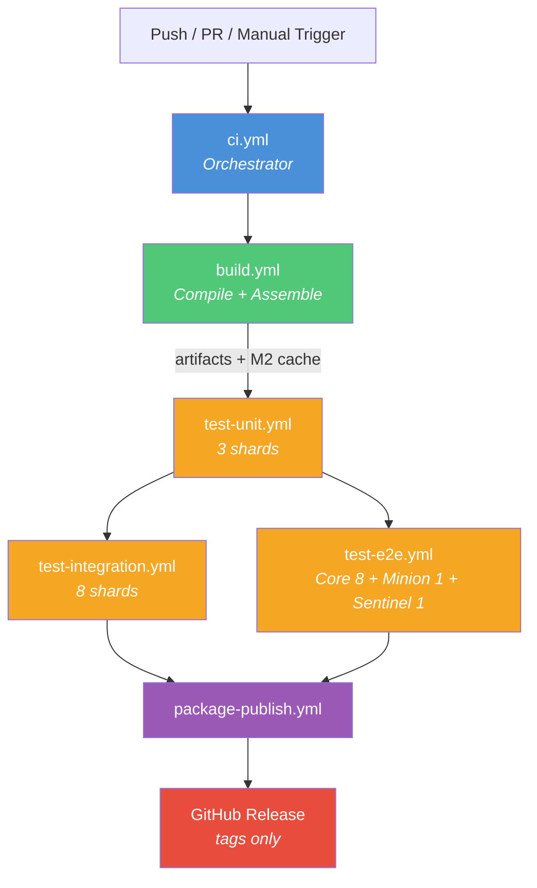
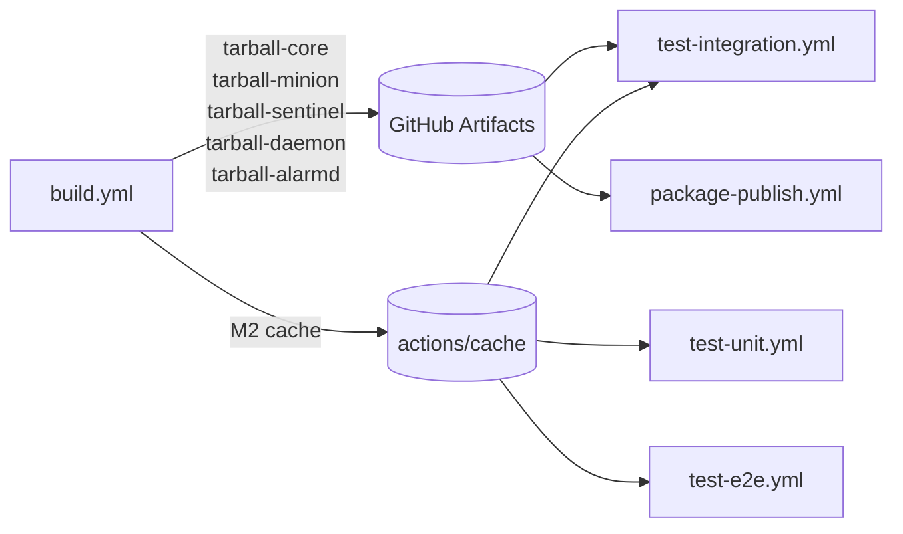
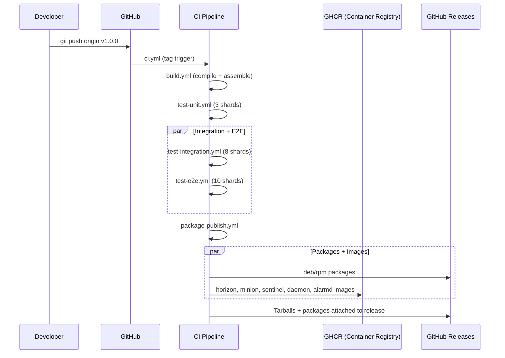

# Delta-V CI/CD

Continuous integration and delivery for the Delta-V project, built on GitHub Actions with a Makefile-driven build interface.

## Architecture Overview

The CI pipeline is split into **6 independent workflow files** that can be triggered individually for debugging or chained together by the orchestrator.

### Pipeline Flow



### Workflow Files

| File | Purpose | Jobs | Triggers |
|------|---------|------|----------|
| `ci.yml` | Orchestrator | Chains all workflows | push, PR, manual |
| `build.yml` | Compile + assemble + upload artifacts | 1 | `workflow_call`, manual |
| `test-unit.yml` | Unit tests | 3 shards | `workflow_call`, manual |
| `test-integration.yml` | Integration tests | 8 shards | `workflow_call`, manual |
| `test-e2e.yml` | End-to-end tests | core (8) + minion (1) + sentinel (1) | `workflow_call`, manual |
| `package-publish.yml` | Packages, OCI images, release | 9 (3 pkg + 5 OCI + 1 release) | `workflow_call`, manual |

### Artifact Flow



The build job compiles once and shares artifacts:
- **Tarballs** — uploaded via `actions/upload-artifact`, downloaded by integration tests and packaging jobs
- **M2 cache** — saved via `actions/cache/save`, restored by all test jobs to avoid redownloading dependencies

### Branch Triggers

The `ci.yml` orchestrator triggers on:

```yaml
push:
  branches: [develop, release-*, ci/*, development/*]
  tags: [v*, delta-v-*]
pull_request:
  types: [opened, synchronize, reopened]
```

### Skip Controls

Skip individual stages via commit message:

```bash
git commit -m "docs: update readme [skip unit-tests]"
git commit -m "fix: quick hotfix [skip e2e-tests-core] [skip integration-tests]"
```

Available skip tokens:
- `[skip build]`
- `[skip unit-tests]`
- `[skip integration-tests]`
- `[skip e2e-tests-core]`, `[skip e2e-tests-minion]`, `[skip e2e-tests-sentinel]`
- `[skip core-packages]`, `[skip minion-packages]`, `[skip sentinel-packages]`
- `[skip core-oci]`, `[skip minion-oci]`, `[skip sentinel-oci]`, `[skip daemon-oci]`, `[skip alarmd-oci]`

---

## Running Locally

All CI targets are available locally via `make`. The Makefile is the single source of truth for both CI and local builds.

### Prerequisites

| Requirement | macOS (Homebrew) | macOS (SDKMAN) | Linux (apt) |
|-------------|-----------------|----------------|-------------|
| JDK 17 | `brew install temurin@17` | `sdk install java 17.0.13-tem` | `apt install temurin-17-jdk` |
| pnpm | `brew install pnpm` | `npm install -g pnpm` | `npm install -g pnpm` |
| Docker | Docker Desktop | Docker Desktop | `apt install docker.io` |
| Python 3 | pre-installed | pre-installed | `apt install python3` |
| fpm (packaging) | `gem install fpm` | `gem install fpm` | `gem install fpm` |

Set `JAVA_HOME` if not auto-detected:

```bash
# macOS Homebrew
export JAVA_HOME=/Library/Java/JavaVirtualMachines/temurin-17.jdk/Contents/Home

# SDKMAN (automatic)
sdk use java 17.0.13-tem

# Linux
export JAVA_HOME=/usr/lib/jvm/temurin-17-jdk-amd64
```

### Verify Dependencies

```bash
make deps-build     # Check Java, Maven, pnpm, etc.
make validate       # Quick Maven structure check
```

### Build

```bash
# Default: quick compile + quick assemble (fastest full build)
make

# Individual steps
make quick-compile       # Compile all modules (skips tests)
make quick-assemble      # Assemble tarballs
make compile-ui          # Build Vue UI only

# Production build (slower, includes expensive tasks)
make compile
make assemble
```

### Run Tests

```bash
# Unit tests (all)
make unit-tests

# Unit tests (single shard, matches CI)
make unit-tests MAVEN_SHARD_IDX=0 MAVEN_SHARDS=3

# Integration tests (needs PostgreSQL)
make spinup-postgres
make integration-tests MAVEN_SHARD_IDX=0 MAVEN_SHARDS=8

# Cleanup
make destroy-postgres
```

### Build Container Images

```bash
# Build all three base images
make core-oci          # -> local/core:latest
make minion-oci        # -> local/minion:latest
make sentinel-oci      # -> local/sentinel:latest

# End-to-end tests (needs OCI images)
make core-e2e MAVEN_SHARD_IDX=0 MAVEN_SHARDS=8
make minion-e2e
make sentinel-e2e
```

### Build Packages

```bash
# Requires fpm: gem install fpm
# RPM also requires: apt install rpm (Linux) or brew install rpm (macOS)

make core-pkg-deb PKG_RELEASE=1
make core-pkg-rpm PKG_RELEASE=1
make all-pkgs PKG_RELEASE=1
```

### Test Discovery and Sharding

The Makefile generates test class lists dynamically:

```bash
make test-lists    # Generates target/artifacts/tests/{unit,integration}_tests_classnames
```

Tests are sharded by line number: `awk "NR % SHARDS == SHARD_IDX"`. This is deterministic (same test always runs in the same shard) unlike timing-based sharding.

Skip individual tests by adding fully-qualified class names to:
- `.cicd-assets/_skipTests.txt` — unit tests
- `.cicd-assets/_skipIntegrationTests.txt` — integration tests

---

## Debugging CI Failures

### Trigger a Single Workflow Manually

Each workflow supports `workflow_dispatch` for independent testing:

```bash
# Trigger just the build
gh workflow run build.yml --ref ci/adopt-bbc-opennms-approach

# Trigger just unit tests (will need M2 cache from a prior build)
gh workflow run test-unit.yml --ref ci/adopt-bbc-opennms-approach

# Trigger packaging (needs tarball artifacts from a prior build)
gh workflow run package-publish.yml --ref ci/adopt-bbc-opennms-approach
```

### View Logs

```bash
# List recent runs
gh run list --branch ci/adopt-bbc-opennms-approach

# View a specific run
gh run view <run-id>

# View failed job logs
gh run view <run-id> --log-failed

# Download test artifacts
gh run download <run-id> -n unit-tests-artifacts-0
```

### Common Failures

| Symptom | Cause | Fix |
|---------|-------|-----|
| `maven-structure-graph` fails | POM syntax error | Run `make validate` locally |
| Unit test count mismatch | Service removed but test expected count not updated | Update expected counts in `core/upgrade/` tests |
| OCI build fails | Tarball not found | Ensure build job completed and uploaded artifacts |
| `spinup-postgres` fails | Docker not running or port 5432 in use | Start Docker, check `docker ps` |
| Test class not found | Test listed in skip file but class was deleted | Remove from `_skipTests.txt` |

### Reproducing CI Locally

To reproduce exactly what CI does for unit test shard 1:

```bash
make quick-compile
make unit-tests MAVEN_SHARD_IDX=1 MAVEN_SHARDS=3
```

For integration test shard 0:

```bash
make quick-compile
make quick-assemble
make spinup-postgres
make integration-tests MAVEN_SHARD_IDX=0 MAVEN_SHARDS=8
```

---

## Extending the CI

### Design Principles

1. **Makefile is the contract** — CI workflows only call `make` targets. All build logic lives in the Makefile, not in YAML.
2. **Build once, test many** — The build job compiles and uploads artifacts. Test jobs restore from cache, they don't rebuild from scratch.
3. **Independent workflows** — Each workflow has `workflow_call` (for chaining) and `workflow_dispatch` (for manual debugging).
4. **Deterministic sharding** — Tests are split by line number, not timing. Same test always runs in the same shard.
5. **Skip controls** — Every job checks `[skip <name>]` in the commit message for fast iteration.

### Adding a New Workflow Stage

1. Create `.github/workflows/my-stage.yml`:

```yaml
---
name: My Stage
on:
  workflow_call:    # Called by ci.yml
  workflow_dispatch: # Manual trigger

permissions: write-all

jobs:
  my-job:
    if: "!contains(github.event.head_commit.message || '', '[skip my-stage]')"
    runs-on: ubuntu-latest
    steps:
      - uses: actions/checkout@v4
      - name: Set up JDK 17
        uses: actions/setup-java@v4
        with:
          distribution: temurin
          java-version: '17'
          cache: maven
      - name: Restore M2 cache
        uses: actions/cache/restore@v4
        with:
          key: m2-${{ hashFiles('**/pom.xml') }}-${{ github.sha }}
          restore-keys: m2-${{ hashFiles('**/pom.xml') }}
          path: ~/.m2/repository
      - name: Run my stage
        run: make my-target
```

2. Add the Makefile target in `Makefile`
3. Wire it into `ci.yml`:

```yaml
my-stage:
  needs: build   # or unit-tests, etc.
  uses: ./.github/workflows/my-stage.yml
  permissions: write-all
```

### Adding a New OCI Image

1. Create `opennms-container/<name>/Dockerfile`
2. Add an assembly module in `opennms-assemblies/<name>/pom.xml`
3. Add `<name>-oci` target to the Makefile (follow the `core-oci` pattern)
4. Add the build step to `build.yml` (upload tarball as artifact)
5. Add the OCI job to `package-publish.yml` (follow `daemon-oci` pattern)

### Adding a New Test Shard

To increase unit test parallelism from 3 to 4 shards:

1. In `test-unit.yml`, change the matrix:
```yaml
matrix:
  shard_idx: [0, 1, 2, 3]  # was [0, 1, 2]
  shards: [4]                # was [3]
```

2. Update artifact names accordingly (they're auto-named by `${{ matrix.shard_idx }}`)

### Adding a Test Skip Rule

Add the fully-qualified class name to the appropriate file:

```bash
# Skip a unit test
echo "org.opennms.netmgt.dao.SomeFlakeyTest" >> .cicd-assets/_skipTests.txt

# Skip an integration test
echo "org.opennms.netmgt.dao.SomeSlowIT" >> .cicd-assets/_skipIntegrationTests.txt
```

Add a comment explaining why:

```
# Requires jrrd2 native library not available in CI
org.opennms.netmgt.dao.SomeFlakeyTest
```

### Adding Package Types

The packaging uses [fpm](https://fpm.readthedocs.io/). To add a new package variant:

1. Add `<name>-pkg-buildroot` and `<name>-pkg-deb`/`<name>-pkg-rpm` targets to the Makefile
2. Add the job to `package-publish.yml` following the `core-packages` pattern
3. Add the artifact to the `create-github-release` job's file list

---

## File Reference

```
.github/workflows/
  ci.yml                  # Orchestrator - chains all workflows
  build.yml               # Compile + assemble + upload artifacts
  test-unit.yml           # Unit tests (3 shards)
  test-integration.yml    # Integration tests (8 shards)
  test-e2e.yml            # E2E: core (8) + minion (1) + sentinel (1)
  package-publish.yml     # deb/rpm + 5 OCI images + GitHub release
  main.yml                # Deprecated stub (see main.yml.bak for original)
  auto-assign.yml         # Auto-assign PR reviewers
  labeler.yml             # Auto-label PRs by path

.cicd-assets/
  _skipTests.txt           # Unit test skip list
  _skipIntegrationTests.txt # Integration test skip list
  find-tests/              # Python test discovery + sharding
    find-tests.py          # Generates test class lists from Maven structure
  postgres/
    compose.yaml           # PostgreSQL 18 for CI (fsync=off for speed)
  pom2version.sh           # Extract version from pom.xml

Makefile                   # All build/test/package/OCI targets
packages/
  pkg-postinst-core.sh     # Core package post-install script
  pkg-postinst-minion.sh   # Minion package post-install script
  pkg-postinst-sentinel.sh # Sentinel package post-install script
```

---

## Release Process

Releases are triggered by pushing a version tag:

```bash
# Automated release via Makefile
make release RELEASE_VERSION=1.0.0 PUSH_RELEASE=true

# Or manually
git tag -a v1.0.0 -m "Release Delta-V 1.0.0"
git push origin v1.0.0
```

The tag triggers the full pipeline: build -> tests -> packages -> OCI images -> GitHub Release with all artifacts attached.


